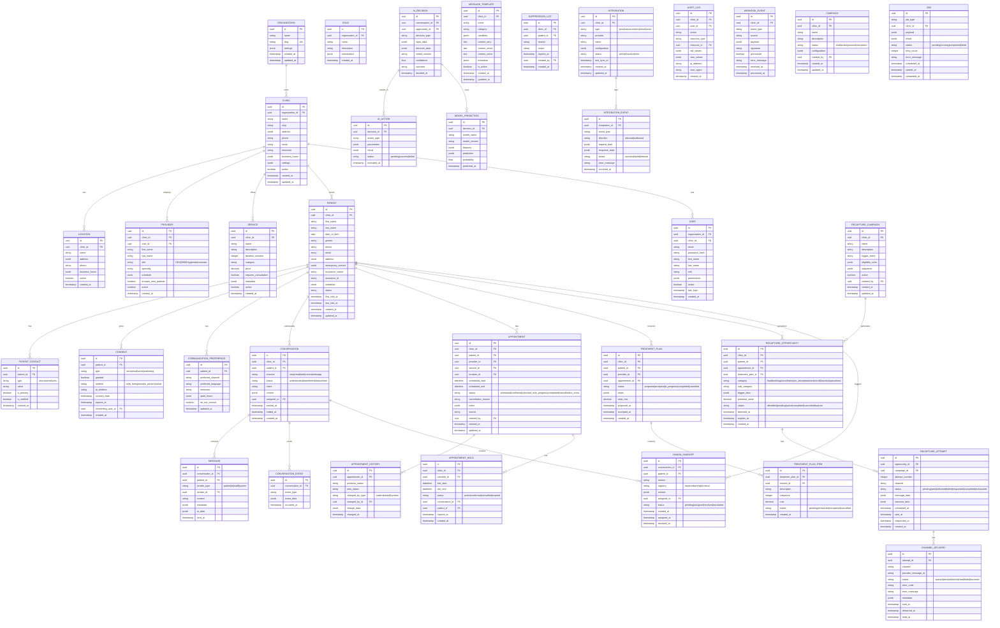

# Entity Relationship Diagram — Database Schema Reference

```mermaid
erDiagram
    %% === TENANT & ORG ===
    ORGANIZATION {
        uuid id PK
        string name
        string slug UK
        jsonb settings
        timestamp created_at
        timestamp updated_at
    }

    CLINIC {
        uuid id PK
        uuid organization_id FK
        string name
        string slug
        jsonb address
        string phone
        string email
        string timezone
        jsonb business_hours
        jsonb settings
        boolean active
        timestamp created_at
        timestamp updated_at
    }

    LOCATION {
        uuid id PK
        uuid clinic_id FK
        string name
        jsonb address
        string phone
        jsonb business_hours
        boolean active
        timestamp created_at
    }

    %% === USERS & ROLES ===
    USER {
        uuid id PK
        uuid organization_id FK
        uuid clinic_id FK
        string email
        string password_hash
        string first_name
        string last_name
        string role
        jsonb permissions
        boolean active
        timestamp last_login
        timestamp created_at
    }

    ROLE {
        uuid id PK
        uuid organization_id FK
        string name
        string description
        jsonb permissions
        timestamp created_at
    }

    %% === PATIENTS ===
    PATIENT {
        uuid id PK
        uuid clinic_id FK
        string first_name
        string last_name
        date date_of_birth
        string gender
        string phone
        string email
        jsonb address
        jsonb emergency_contact
        string insurance_carrier
        string insurance_id
        jsonb metadata
        string status
        timestamp first_visit_at
        timestamp last_visit_at
        timestamp created_at
        timestamp updated_at
    }

    PATIENT_CONTACT {
        uuid id PK
        uuid patient_id FK
        string type "phone|email|sms"
        string value
        boolean is_primary
        boolean is_verified
        timestamp created_at
    }

    CONSENT {
        uuid id PK
        uuid patient_id FK
        string type "sms|email|voice|marketing"
        boolean granted
        string method "web_form|phone|in_person|verbal"
        string ip_address
        timestamp consent_date
        timestamp expires_at
        uuid consenting_user_id FK
        timestamp created_at
    }

    COMMUNICATION_PREFERENCE {
        uuid id PK
        uuid patient_id FK
        string preferred_channel
        string preferred_language
        string timezone
        jsonb quiet_hours
        boolean do_not_contact
        timestamp updated_at
    }

    %% === CONVERSATIONS ===
    CONVERSATION {
        uuid id PK
        uuid clinic_id FK
        uuid patient_id FK
        string channel "sms|email|web|voice|whatsapp"
        string status "active|ended|transferred|abandoned"
        string intent
        jsonb context
        uuid assigned_to FK
        timestamp started_at
        timestamp ended_at
        timestamp created_at
    }

    MESSAGE {
        uuid id PK
        uuid conversation_id FK
        uuid patient_id FK
        string sender_type "patient|ai|staff|system"
        uuid sender_id FK
        string content
        jsonb metadata
        jsonb ai_data
        timestamp sent_at
    }

    CONVERSATION_EVENT {
        uuid id PK
        uuid conversation_id FK
        string event_type
        jsonb event_data
        timestamp occurred_at
    }

    %% === APPOINTMENTS ===
    APPOINTMENT {
        uuid id PK
        uuid clinic_id FK
        uuid patient_id FK
        uuid provider_id FK
        uuid service_id FK
        uuid location_id FK
        datetime scheduled_start
        datetime scheduled_end
        string status "scheduled|confirmed|checked_in|in_progress|completed|cancelled|no_show"
        string cancellation_reason
        jsonb notes
        string source
        uuid created_by FK
        timestamp created_at
        timestamp updated_at
    }

    APPOINTMENT_HISTORY {
        uuid id PK
        uuid appointment_id FK
        string previous_status
        string new_status
        string changed_by_type "patient|ai|staff|system"
        uuid changed_by_id FK
        jsonb change_data
        timestamp changed_at
    }

    APPOINTMENT_HOLD {
        uuid id PK
        uuid clinic_id FK
        uuid provider_id FK
        datetime slot_start
        datetime slot_end
        string status "active|confirmed|cancelled|expired"
        uuid conversation_id FK
        uuid patient_id FK
        timestamp expires_at
        timestamp created_at
    }

    %% === SERVICES & PROVIDERS ===
    SERVICE {
        uuid id PK
        uuid clinic_id FK
        string name
        string description
        integer duration_minutes
        string category
        decimal price
        boolean requires_consultation
        jsonb metadata
        boolean active
        timestamp created_at
    }

    PROVIDER {
        uuid id PK
        uuid clinic_id FK
        uuid user_id FK
        string first_name
        string last_name
        string title "DDS|DMD|Hygienist|Assistant"
        string specialty
        jsonb schedule
        boolean accepts_new_patients
        boolean active
        timestamp created_at
    }

    %% === TREATMENT PLANS ===
    TREATMENT_PLAN {
        uuid id PK
        uuid clinic_id FK
        uuid patient_id FK
        uuid provider_id FK
        uuid appointment_id FK
        string status "proposed|accepted|in_progress|completed|cancelled"
        jsonb notes
        decimal total_cost
        timestamp proposed_at
        timestamp accepted_at
        timestamp created_at
    }

    TREATMENT_PLAN_ITEM {
        uuid id PK
        uuid treatment_plan_id FK
        uuid service_id FK
        string description
        integer sequence
        decimal cost
        string status "pending|scheduled|completed|cancelled"
        timestamp created_at
    }

    %% === RECAPTURE ===
    RECAPTURE_OPPORTUNITY {
        uuid id PK
        uuid clinic_id FK
        uuid patient_id FK
        uuid appointment_id FK
        uuid treatment_plan_id FK
        string category "lead|booking|cancellation|no_show|treatment|recall|inactive|operational"
        string sub_category
        jsonb trigger_data
        decimal potential_value
        string status "identified|pending|active|completed|cancelled|expired"
        timestamp detected_at
        timestamp expires_at
        timestamp created_at
    }

    RECAPTURE_CAMPAIGN {
        uuid id PK
        uuid clinic_id FK
        string name
        string description
        string trigger_event
        jsonb eligibility_rules
        jsonb sequence
        boolean active
        uuid created_by FK
        timestamp created_at
        timestamp updated_at
    }

    RECAPTURE_ATTEMPT {
        uuid id PK
        uuid opportunity_id FK
        uuid campaign_id FK
        integer attempt_number
        string channel
        string status "pending|sent|delivered|failed|responded|completed|exhausted"
        jsonb message_data
        jsonb outcome_data
        timestamp scheduled_at
        timestamp sent_at
        timestamp responded_at
        timestamp created_at
    }

    CHANNEL_DELIVERY {
        uuid id PK
        uuid attempt_id FK
        string channel
        string provider_message_id
        string status "queued|sent|delivered|read|failed|bounced"
        string error_code
        string error_message
        jsonb metadata
        timestamp sent_at
        timestamp delivered_at
        timestamp read_at
    }

    %% === AI ===
    AI_DECISION {
        uuid id PK
        uuid conversation_id FK
        uuid opportunity_id FK
        string decision_type
        jsonb input_data
        jsonb decision_data
        string model_version
        float confidence
        string outcome
        timestamp decided_at
    }

    AI_ACTION {
        uuid id PK
        uuid decision_id FK
        string action_type
        jsonb parameters
        jsonb result
        string status "pending|success|failed"
        timestamp executed_at
    }

    MODEL_PREDICTION {
        uuid id PK
        uuid decision_id FK
        string model_name
        string model_version
        jsonb features
        jsonb prediction
        float probability
        timestamp predicted_at
    }

    HUMAN_HANDOFF {
        uuid id PK
        uuid conversation_id FK
        uuid patient_id FK
        string reason
        string urgency "low|medium|high|critical"
        jsonb context
        uuid assigned_to FK
        string status "pending|assigned|resolved|escalated"
        timestamp created_at
        timestamp assigned_at
        timestamp resolved_at
    }

    %% === MESSAGING ===
    MESSAGE_TEMPLATE {
        uuid id PK
        uuid clinic_id FK
        string name
        string category
        jsonb variables
        text content_sms
        text content_email
        text content_voice
        jsonb metadata
        boolean is_active
        timestamp created_at
        timestamp updated_at
    }

    SUPPRESSION_LIST {
        uuid id PK
        uuid clinic_id FK
        uuid patient_id FK
        string reason
        string scope
        timestamp expires_at
        uuid created_by FK
        timestamp created_at
    }

    %% === INTEGRATIONS ===
    INTEGRATION {
        uuid id PK
        uuid clinic_id FK
        string type "pms|insurance|sms|email|voice"
        string provider
        string name
        jsonb configuration
        string status "active|inactive|error"
        timestamp last_sync_at
        timestamp created_at
        timestamp updated_at
    }

    INTEGRATION_EVENT {
        uuid id PK
        uuid integration_id FK
        string event_type
        string direction "inbound|outbound"
        jsonb request_data
        jsonb response_data
        string status "success|failed|timeout"
        string error_message
        timestamp occurred_at
    }

    %% === AUDIT ===
    AUDIT_LOG {
        uuid id PK
        uuid clinic_id FK
        uuid user_id FK
        string action
        string resource_type
        uuid resource_id FK
        jsonb old_values
        jsonb new_values
        string ip_address
        string user_agent
        timestamp created_at
    }

    WEBHOOK_EVENT {
        uuid id PK
        uuid clinic_id FK
        string event_type
        string source
        jsonb payload
        string signature
        boolean processed
        string error_message
        timestamp received_at
        timestamp processed_at
    }

    %% === CAMPAIGNS ===
    CAMPAIGN {
        uuid id PK
        uuid clinic_id FK
        string name
        string description
        string status "draft|active|paused|completed"
        jsonb configuration
        uuid created_by FK
        timestamp created_at
        timestamp updated_at
    }

    %% === JOBS ===
    JOB {
        uuid id PK
        string job_type
        uuid clinic_id FK
        jsonb payload
        jsonb result
        string status "pending|running|completed|failed"
        integer retry_count
        string error_message
        timestamp scheduled_at
        timestamp started_at
        timestamp completed_at
    }

    %% === RELATIONSHIPS ===
    ORGANIZATION ||--o{ CLINIC : "owns"
    CLINIC ||--o{ LOCATION : "has"
    CLINIC ||--o{ PROVIDER : "employs"
    CLINIC ||--o{ SERVICE : "offers"
    CLINIC ||--o{ PATIENT : "serves"
    CLINIC ||--o{ USER : "has"

    PATIENT ||--o{ PATIENT_CONTACT : "has"
    PATIENT ||--o{ CONSENT : "gives"
    PATIENT ||--o{ COMMUNICATION_PREFERENCE : "has"
    PATIENT ||--o{ CONVERSATION : "participates"
    PATIENT ||--o{ APPOINTMENT : "has"
    PATIENT ||--o{ TREATMENT_PLAN : "receives"
    PATIENT ||--o{ RECAPTURE_OPPORTUNITY : "generates"
    PATIENT ||--o{ HUMAN_HANDOFF : "triggers"

    CONVERSATION ||--o{ MESSAGE : "contains"
    CONVERSATION ||--o{ CONVERSATION_EVENT : "tracks"
    CONVERSATION ||--o{ HUMAN_HANDOFF : "creates"

    APPOINTMENT ||--o{ APPOINTMENT_HISTORY : "has"
    APPOINTMENT ||--o{ APPOINTMENT_HOLD : "has"

    TREATMENT_PLAN ||--o{ TREATMENT_PLAN_ITEM : "contains"

    RECAPTURE_CAMPAIGN ||--o{ RECAPTURE_OPPORTUNITY : "generates"
    RECAPTURE_OPPORTUNITY ||--o{ RECAPTURE_ATTEMPT : "has"
    RECAPTURE_ATTEMPT ||--o{ CHANNEL_DELIVERY : "has"

    AI_DECISION ||--o{ AI_ACTION : "results_in"
    AI_DECISION ||--o{ MODEL_PREDICTION : "uses"

    INTEGRATION ||--o{ INTEGRATION_EVENT : "logs"
```
